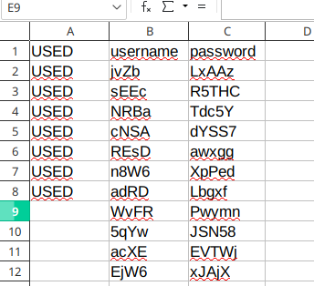
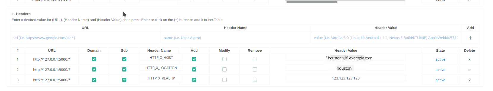

# 💸CaptivePortalStripe💸
<p align="center">

</p>

---
This is a python script to help you sell your Voucher codes with Stripe. I made it for personal use but I wanted to share it

It support only two plan, a reccuring month plan and a one-time payment week plan but you can add more or less without too much change in the code.

I made it to support multiple zone if I go worldwide one day, I called it Location but I only have "houston" here.

In the MailConfig section of Settings.json I added SendMailAs wich is if you have a different username than your email address and Admin is your mail address where all the problem will go.

Its designed for French/Spanish people, I also added english because why not, its not my main language though.

The python-stripe AUR is out of date you need to modify the PKGBUILD like I did at the end

I use Nginx, if you are using Caddy, Apache or anything else you will need to adapt (the hard part is to set a header so you should be good)

Its based on this Codepen design https://codepen.io/xhepigerta/pen/oxxQaw


### Files📃

* ***CaptivePortalStripe.py*** - The main program
* ***PaymentHistory.xlsx*** - Human readable history
* ***log.log*** - Log sent by systemD
  > I don't think I will make a log system inside the pyhon script because with this method I get everything without touching anything

* ***SessionID.json*** - A backup of the session_id that Stripe return that server mainly to avoid re-using a valid session_id and also as a log if you feel it
* ***Settings.json*** - Your settings
* ***templates/...*** - HTML files
* ***static/...*** - CSS/JS/WEBP files
* ***Voucher/...*** - OPNsense generated Voucher files converted into xlsx
  > I will probably do something to just drag and drop the generated voucher files

### Librarys

* [OpenPyxl](https://pypi.org/project/openpyxl/) - Modify xlsx files
* [Flask](https://pypi.org/project/Flask/) - To create the web server
* [Flask-Mail](https://pypi.org/project/Flask-Mail/) - To send mails
* [Stripe](https://pypi.org/project/stripe/) - To communicate with Stripe

If you are using Arch `python-flask`, `python-flask-mail` and `python-openpyxl` are in the community repository !

Stripe is in the AUR and out of date 😟

# Setup Test🧪

* Clone this repository
* `cd CaptivePortalStripe`
* Edit `Settings.json` to fit your need
* Generate some Voucher for a week with opnsense and copy the IDs and the passwords in a xlsx file named (houston for example) `houston-Week.xlsx` or `houston-Month.xlsx` inside the Voucher directory it should look like this (mine is used) :

* Repeat for the Month plan
* Now you can start it with `python CaptivePortalStripe.py English`
  > Note: Its designed to use Python 3 (3.7.4) and you can choose between English and French (backend only)

* Install an extension to modify the headers for example https://addons.mozilla.org/fr/firefox/addon/modify-header-value/ and set it up like this:


# Setup Live😎

### VPS and Location
At first, I used a raspberry but I wanted to do something else with it and I also wanted https so I bought a VPS and I took the occasion to install this https://github.com/Ysurac/openmptcprouter, you may want to check it out.

The Location setting is if you have multiple Zone and different Voucher for them. I make it in such a way that you need to create a subdomain and create a Header with nginx to tell wich Location is it so for https://houston.domain.com Nginx will create a Header called HTTP_X_LOCATION with "houston" inside and the python script will look for houston-Month.xlsx or houston-Week.xlsx when he look for a Voucher

* Create a subdomain in your DNS record
* Create a Nginx config file as my example below
* Modify Houston in Settings.json as well

Next on your server

* Create a user with `sudo useradd -m -d /CaptivePortalStripe captiveportalstripe`
* Change its password (I don't know if its required) `sudo passwd captiveportalstripe`
* Switch to this user `su captiveportalstripe`
* Go to his home directory `cd`
* `git clone https://github.com/RomanJos/CaptivePortalStripe.git`
* `mv CaptivePortalStripe/* .`
* `rm -rf CaptivePortalStripe`
* `exit`
* Create the systemD service like the example below with `sudo systemctl edit --force --full CaptivePortalStripe`
* enable it at boot `sudo systemctl enable CaptivePortalStripe`
* start it `sudo systemctl start CaptivePortalStripe`

### Stripe
* Open a Stripe account, you don't need to be verified to make it work
* Put your api key in settings.json
* Create two product (month and week) as explained [here](https://stripe.com/docs/payments/checkout/subscriptions/starting#create-products-and-plans) for reccuring and [here](https://stripe.com/docs/payments/checkout/client) for one-time payment
At this point you should have "sku_FuanUXnYNE8nH8" for One-time and/or "plan_Fv1W36peMAhWK2" for reccuring. And of course your API keys. Put them in Settings.json

### Mail if you are using Gmail
* Activate Less-secure app https://www.saleshandy.com/smtp/gmail-smtp-settings/
* Enter your new app password in Settings.json and your mail of course, its already pre-configured

### OPNsense Captive portal Settings
* Upload OPNsenseCaptivePortalTemplate.zip in "Templates" tab of the Captive portal administration settings
* Create a new zone and enter your VPS'IP and the Stripe ip like below in "Allowed addresses" field
* In Unboud or DNSmasq enter the Stripe domains and their IP addresses in ovverride, this is to "lock" their IPs and don't mess with the Allowed addresses in the zone config

---

### Sample Systemd service file

```
[Unit]
Description=CaptivePortalStripe

[Service]
ExecStart=/bin/bash -ce "exec /usr/bin/python -u /CaptivePortalStripe/CaptivePortalStripe.py >> /CaptivePortalStripe/log.log 2>&1"
User=captiveportalstripe
WorkingDirectory=/CaptivePortalStripe/
Restart=on-failure

[Install]
WantedBy=multi-user.target
```

### Sample Nginx config file

This is my config as example with Houston, edit it as you like
```nginx
# http => https
server {
    listen 80;
    listen [::]:80; # IPv6 support
    server_name houston.wifi.domain.com;

    include preset/BasicRestriction;
    location / {
        return 301 https://$host$request_uri;
        include 'preset/HSTS';
        include 'preset/SecurityHeaders';
    }
}
server {
    listen 443 ssl http2;
    listen [::]:443 ssl http2;
    server_name houston.wifi.domain.com;

    # Logs
    access_log /var/log/nginx/CaptivePortalStripe.log;
    error_log /var/log/nginx/CaptivePortalStripe.log;

    include preset/WildcardCertificate;#if you have multiple subdomain like me make sure to include them in the certificate *.domain.com *.wifi.domain.com
    include preset/SSL; # cipher eliptic curve et tout le bordel lol
    include preset/Development; #Pour éviter le réferencement etc
    include preset/BasicRestriction; # éviter les accès au .git etc
    location / {
        allow 64.18.0.0/20; #Here I allow only my ISP IP block
        allow 64.233.160.0/19;
        deny all; # deny the rest
        proxy_cache off;
        proxy_buffering off;
        proxy_redirect off;
        proxy_set_header HTTP_X_HOST $host;
        proxy_set_header HTTP_X_REAL_IP $remote_addr;
        proxy_set_header HTTP_X_LOCATION houston; # This is where I set the header
        proxy_pass http://127.0.0.1:5000;
        include 'preset/HSTS';
        include 'preset/SecurityHeaders';
    }
    # redirect server error pages to the static page
    error_page 403 403WiFi.html; #The default path for this is /etc/nginx/html/403WiFi.html
    location = /403WiFi.html {
       root html;
   }
}
```
* Check if you didn't messed up your Nginx config`sudo nginx -t`
* and restart Nginx `sudo systemctl restart nginx.service`

### My list of Stripe IP :

Make sure to have them configured in your dns override and in the allowed addresses  section of the captive portal
 - q.stripe.com -> 54.187.159.182
 - m.stripe.network -> 13.225.38.34
 - js.stripe.com -> 151.101.12.176
 - checkout.stripe.com -> 151.101.120.176
 - api.stripe.com -> 34.241.202.139
 - stripe.com -> 54.186.23.98

### PKGBUILD diff (Arch)

```diff
diff --git a/PKGBUILD b/PKGBUILD
index 865f71f..fa933a4 100644
--- a/PKGBUILD
+++ b/PKGBUILD
@@ -1,7 +1,7 @@
 # Maintainer: Dylan Whichard <dylan@whichard.com>
 _name=stripe
 pkgname=python-stripe
-pkgver=1.28.0
+pkgver=2.39.0
 pkgrel=1
 pkgdesc='Stripe python bindings'
 arch=('any')
@@ -9,8 +9,8 @@ url="https://github.com/stripe/stripe-python"
 license=('MIT')
 depends=('python>=3.0')
 makedepends=('python-setuptools')
-source=("https://pypi.python.org/packages/source/${_name:0:1}/$_name/$_name-$pkgver.tar.gz")
-md5sums=('3a655a9fed56611adb288171cf9996d8')
+source=("https://files.pythonhosted.org/packages/dd/94/2d692fb36594c411cf6d341b3fd68e6c7d239a7f0948b127955a9b04a034/stripe-2.39.0.tar.gz")
+md5sums=('SKIP')

 package() {
 	cd "$srcdir/$_name-$pkgver"
```

## TODOS
* Send Mail in HTML
* Use CSV instead of xlsx
* Change the Voucher file to allow a drag and drop of the opnsense's generated one
